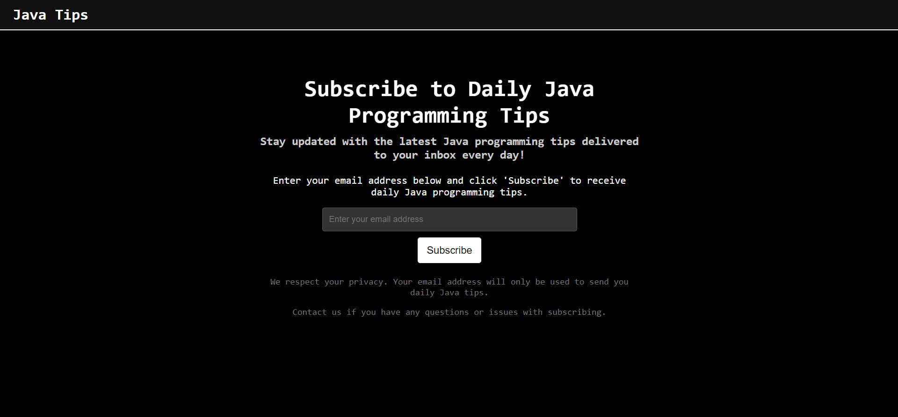

# JavaTipsMailer

JavaTipsMailer is a full-stack web application that allows users to subscribe to daily Java programming tips. The application is built using Spring Boot for the backend, React for the frontend, and MongoDB for data storage. Subscribed users receive daily Java tips via email, scheduled to be sent at 9 AM every day.

## Features

- **User Subscription:** Users can subscribe to receive daily Java programming tips via email.
- **Daily Email Scheduler:** Automatically sends Java tips to subscribed users at 9 AM every day.
- **Email Templates:** Utilizes Thymeleaf for professional and standardized email designs.
- **Responsive Frontend:** Built with React and styled for a seamless user experience.

## Screenshot



## Tech Stack

### Backend
- **Java 17**
- **Spring Boot 3**
  - `spring-boot-starter-web`
  - `spring-boot-starter-data-mongodb`
  - `spring-boot-starter-thymeleaf`
  - `spring-boot-starter-validation`
- **Lombok**
- **Jakarta Mail**

### Frontend
- **React** (using Vite)
  - `axios`: ^1.7.2
  - `canvas-confetti`: ^1.9.3
  - `react`: ^18.3.1
  - `react-dom`: ^18.3.1

### Database
- **MongoDB** (latest version)

## Project Setup

### Backend

1. **Clone the repository:**
   ```sh
   git clone https://github.com/AGRAH-M-V/java-tips-mail-sender.git
   cd java tips mail sender/API
   
2. **Set up MongoDB:**
   Make sure you have MongoDB installed and running on your machine. Configure the MongoDB connection URI in application.properties.

3. **Run the Spring Boot application:**
   ```sh
   ./mvnw spring-boot:run
   
### Frontend

4. **Navigate to the frontend directory:**
   ```sh
   cd ../UI

5. **Install dependencies:**
   ```sh
   npm install

6. **Run the React application:**
   ```sh
   npm run dev
   
7. **Usage**
   Open the application in your browser at http://localhost:5173.
   Enter your email address in the subscription form to subscribe to daily Java tips.
   Check your email every day at 9 AM to receive your Java programming tip.
